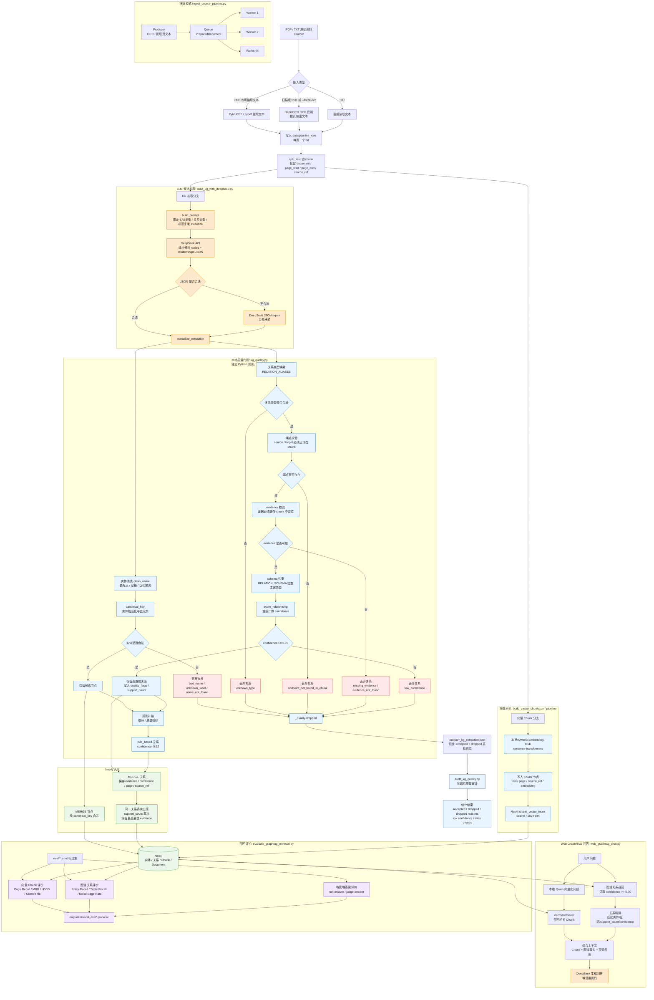

# 石化 GraphRAG 全流程图

> 说明：DeepSeek 只负责从文本中生成“候选实体/关系 JSON”。过滤、证据校验、实体规范化、置信度计算、规则补抽都由本地 Python 模块 `kg_quality.py` 独立完成，不是同一个 LLM 再判断一遍。



## 核心回答

- **LLM 抽取和质量过滤不是同一个步骤。**
- DeepSeek 做的是候选抽取：根据 prompt 从 chunk 中输出 JSON。
- `kg_quality.py` 做的是本地确定性质量门控：证据定位、端点检查、schema 约束、置信度重算、低置信过滤。
- 只有通过 `kg_quality.py` 的节点和关系才会写入 Neo4j。
- `audit_kg_quality.py` 不参与入库，只读取 `output/*_kg_extraction.json` 做抽取后审计。

## 快速模式并行关系

快速模式 `ingest_source_pipeline.py` 不是先完整 OCR 再完整抽取，而是：

```text
Producer 一边按页 OCR/提取文本 -> Queue
多个 Worker 一边消费页面文本 -> DeepSeek 抽取 + kg_quality 过滤 + Neo4j 写入 + Qwen 向量写入
```

所以页码信息是在最早的页面文本阶段就写入，并一路传递到 chunk、关系证据、Chunk 向量节点和最终引用。
